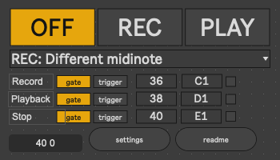

# tesser_insert

This M4Live device processes different MIDI inputs to handle a 'insert switch'.
Thius switch has three fundamental states:

- EMPTY
- OFF (not playing, but stored sth)
- Recording
- Playing

---

## Recording

Therea are different recording modes.

1. Simply send a --no note-off-- midi notem, when the state is OFF.
2. Require a specific --different-- note for recrding, than the one used for playback.
3. Require a modifier (via midinote or CC) that sets the device ready to either record or play.

---

## PLayback

---

## Clear memory

---

## Use Case
